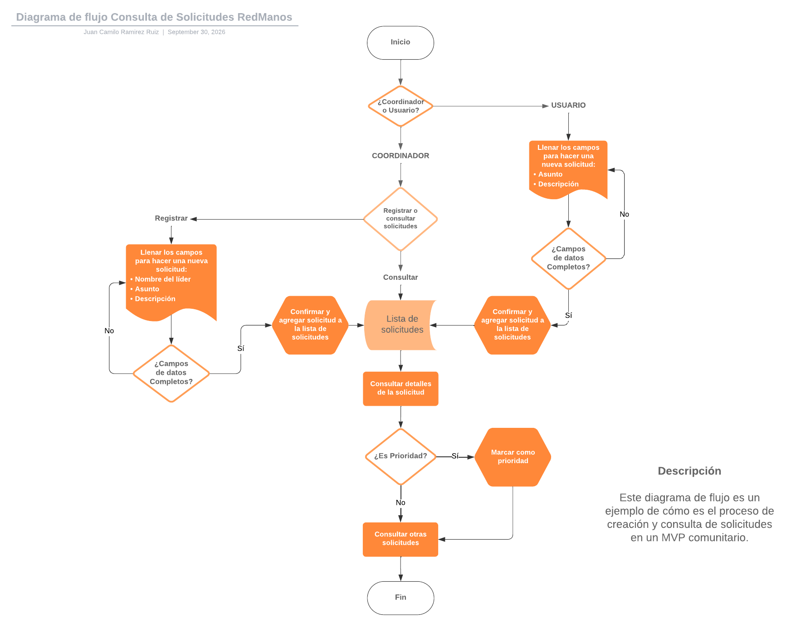

# **ConectaBarrio - MVP Comunitario**

**- Problemática:**

La organización social RedManos, apoya la participación de los lideres comunitarios de cada barrio con la gestión de solicitudes de cada barrio. Actualmente tienen multiples funentes de solicitudes. Reciben estas solicitues por medio de llamadas, mensajes, correos y notas personales. Este modelo de negocio causa problemas para recibir, priorizar, gestionar y confirmar las solicitudes, además que se dificulta el poder visualizar las solicitudes de manera ordenada y estructurada para análisis de datos. 

## **- Objetivo**

Construir una aplicación web, desplegable en computador o celular que permita recibir,priorizar, gestionar y hacer consultas de solicitudes comunitarias y de los lideres comunitarios.

### **- Usuario Principal:** Coordinador de la organización RedManos

### **- Funciones impresindibles del MVP:**

    1. Consultar Lista de solicitudes registradas en la plataforma. 

    2. Buscar Solicitudes y Lideres comunitarios especificos.

    3. Marcar Prioridad en solicitudes especificas.

    4. Registrar nuevas solicitudes. 

    5. Visulaizar lista de solicitudes y lista de lideres comunitarios.

### **- Elementos fuera de alcance:**

     El propósito de un MVP es poder validar el  flujo, demostrar la arquitectura y preparar la futura integración de un backend propio. 
     Por lo tanto se excluyen: 

    1. Creación o modificación del backend

    2. Autenticación, JWT,guards, interceptores, roles, Spring Security.

    3. Pruebas automatizadas.

### **- Riesgo principal: Uso de API simulada**

En una API simulada se utiliza JSONPlaceholder, que es una API REST online que devuelve datos ficticios en formato JSON. 
Esto facilita el levantamiento de un backkend simulado con CRUDS no persistentes(los datos se reinician al recargar). Omitir el uso de esta API rest es un riesgo ya que vende la idea de que el programa cuenta con endpoints persistentes y un backend montado. 

### **Diagrama de Flujo:**

### **Página Responsive en diferentes tamaños**

La barra lateral se inicializa cerrada, al hacer clic en el icono del menu, se despliega hacia la derecha mostrando los botones de "inicio", Solicitudes","lideres". 

Cuando el ancho de la pantalla es 500 o menos, el comportamiento de la barra cambia. Primero, la visibilidad de la barra desaparece, mostrando una pantalla limpia, solo conservando la barra horizontal que se mantiene visible cuando se hace scroll. Segundo, al desplegar el menu vertical, los iconos de los botones desaparecen y solo se muestran los nombres.

**Navegador web:**

**Tamaño 390x1280:**
![Mobile phone mockup showing the RedManos app interface in portrait format. At the top left, a menu icon sits beside the RedManos logo and the word RedManos, with a circular user icon at the top right. The main screen area is a large light gray panel with no visible content. The phone is centered on a dark gray background, and a simple bottom navigation area with interface icons appears near the lower edge. The overall mood is clean, minimal, and professional, suitable for a responsive dashboard for community request management.](images/inicio_390x1280.png)

**Tamaño 390x1280 menu desplegado:**
![RedManos mobile app interface in a narrow portrait layout with a dark blue sidebar, a left-side menu, and a large light gray content area. At the top of the sidebar, the RedManos logo and a circular user icon are visible. The app displays the greeting Hola, RedManos with three blue navigation buttons labeled Inicio, Solicitudes, and Líderes. The design is clean, minimal, and professional, set on a dark gray background that simulates a mobile device frame. Visible text includes RedManos, Hola, RedManos, Inicio, Solicitudes, and Líderes.](images/390x1280.png)

### **Matriz de Traducción**

## Campos de la solicitud

| Campo (API) | Etiqueta visible | Comportamiento |
|:------------|:-------------|:---------------|
| `title`  | Asunto | Ancho máximo de `30ch`. Si el texto excede ese límite, se oculta el sobrante. |
| `body`   | Descripción | No aparece en el listado. Se delimita a `30ch` por línea y hace salto de línea. |
| `userId` | Líder relacionado | Se usan dos `signals`: una con los datos de las solicitudes y otra con los datos de los líderes. Un `computed` recibe por URL el id de la solicitud, la busca y luego obtiene el líder relacionado a partir de su `userId`. |
| `id`     | Caso # | Maneja el estado de carga del caso (ver tabla siguiente). |

## Estados de carga del caso

| Estado | Qué se muestra |
|:-------|:---------------|
| Cargando | Mensaje "Cargando datos del Asunto" |
| Error | Mensaje "No se pudo cargar los datos" |
| Con datos, pero el id no aparece | "No existe una solicitud con ese id"|

## Campos de Líder

| Campo (API) | Etiqueta visible|Comportamiento |
|:------------|:-------------|:---------------|
| `name` | Nombre | Aparece como líder relacionado en las solicitudes y en el listado de líderes. |
| `email` | Email | Se muestra como dato de contacto. |
| `phone` | Teléfono | Se muestra como dato de contacto. |
| `address.city` | Barrio | Se muestra como dato de contacto. |